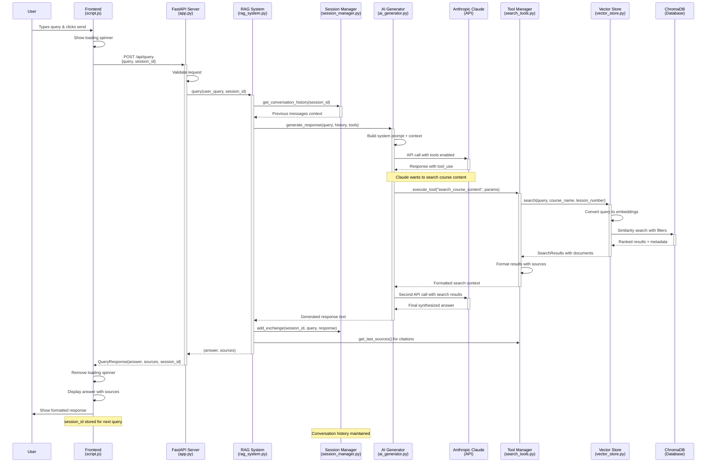

# RAG Chatbot Query Processing Flow

## Key Components & Responsibilities

### Frontend Layer
- **script.js**: User interface, API calls, message display
- **HTML/CSS**: Chat interface, loading states, source citations

### API Layer  
- **app.py**: FastAPI endpoints, request validation, CORS handling
- **models.py**: Pydantic models for request/response structure

### RAG Orchestration
- **rag_system.py**: Main coordinator between all components
- **session_manager.py**: Conversation history and context management

### AI & Search
- **ai_generator.py**: Claude API integration, tool execution handling
- **search_tools.py**: Tool definitions and search result formatting
- **vector_store.py**: ChromaDB interface, embedding generation

### Data Processing
- **document_processor.py**: Text chunking, course structure parsing
- **ChromaDB**: Vector storage, similarity search, metadata filtering

## Flow Characteristics

1. **Stateful Conversations**: Session management maintains context across queries
2. **Tool-Augmented AI**: Claude decides when to search based on query content
3. **Semantic Search**: Vector embeddings enable contextual content retrieval  
4. **Source Attribution**: Search results provide citations for transparency
5. **Filtered Search**: Can target specific courses or lessons when requested
6. **Async Processing**: Non-blocking operations with loading indicators

## Error Handling

- Network failures → Frontend shows error message
- Search failures → Tools return "No results found" 
- AI failures → FastAPI returns 500 status with error details
- Session failures → Creates new session automatically